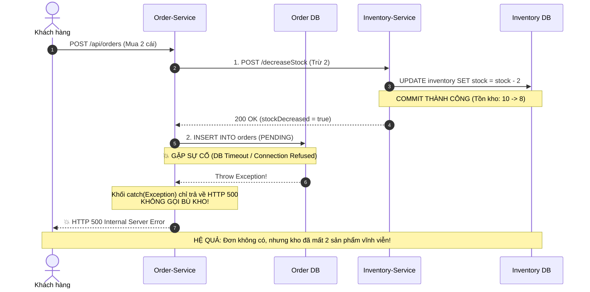
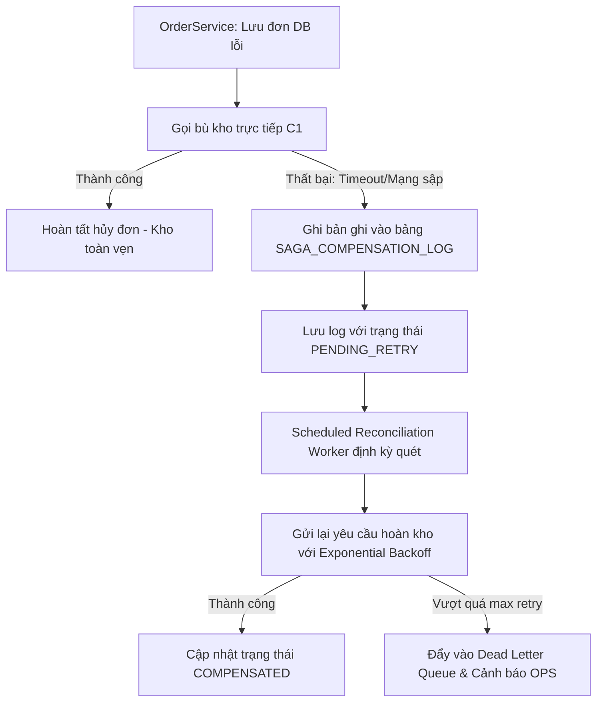

# BÁO CÁO PHÂN TÍCH VÀ GIẢI PHÁP VÁ LỖ HỔNG "KHO TREO" (ROLLBACK LOGIC & SAGA COMPENSATING TRANSACTION)

**Học phần:** Kiến trúc Microservices (IT214) - Session 14: Distributed Transactions & Saga Pattern  
**Đề tài:** Bài tập 1 - Vá lỗ hổng "Kho treo" (Phantom Stockout) trong quy trình Đặt hàng  
**Tác giả:** Kỹ sư hệ thống StoreX  

---

## MỤC LỤC
1. [TỔNG QUAN TÌNH HUỐNG NGHIỆP VỤ](#1-tổng-quan-tình-huống-nghiệp-vụ)
2. [YÊU CẦU A: PHÂN TÍCH NGUYÊN NHÂN GÂY RA TRẠNG THÁI "HÀNG ẢO"](#2-yêu-cầu-a-phân-tích-nguyên-nhân-gây-ra-trạng-thái-hàng-ảo)
3. [YÊU CẦU B: CHỈNH SỬA MÃ NGUỒN VỚI GIAO DỊCH BÙ (COMPENSATING TRANSACTION)](#3-yêu-cầu-b-chỉnh-sửa-mã-nguồn-với-giao-dịch-bù-compensating-transaction)
4. [YÊU CẦU C: GIẢI PHÁP BỀN VỮNG KHI BƯỚC BÙ TRỪ CŨNG BỊ LỖI (SAGA & OUTBOX PATTERN)](#4-yêu-cầu-c-giải-pháp-bền-vững-khi-bước-bù-trừ-cũng-bị-lỗi-saga--outbox-pattern)
5. [KẾT QUẢ KIỂM THỬ THỰC NGHIỆM VÀ KẾT LUẬN](#5-kết-quả-kiểm-thử-thực-nghiệm-và-kết-luận)

---

## 1. TỔNG QUAN TÌNH HUỐNG NGHIỆP VỤ

Trong hệ thống thương mại điện tử StoreX, quy trình đặt hàng hiện tại gồm 2 microservices:
1. **Order-Service:** Tiếp nhận yêu cầu mua sắm và tạo bản ghi đơn hàng trong cơ sở dữ liệu (`Order DB`).
2. **Inventory-Service:** Quản lý số lượng tồn kho của các mặt hàng trong cơ sở dữ liệu (`Inventory DB`).

### Phản ánh từ khách hàng:
> *"Tôi đặt mua sản phẩm iPhone 15, hệ thống báo lỗi thanh toán/tạo đơn thất bại (HTTP 500), đơn hàng không hề xuất hiện trong lịch sử mua hàng. Tuy nhiên, khi tôi tải lại trang để đặt lại thì sản phẩm đã báo 'HẾT HÀNG'. Số lượng tồn kho thực tế bị trừ mất mà không có đơn hàng nào được sinh ra!"*

### Hiện trạng mã nguồn kế thừa (Legacy Code):
```java
// OrderService.java (Legacy)
public ResponseEntity<Order> createOrder(OrderRequest request) {
    // 1. Gọi Inventory Service để trừ kho qua HTTP
    boolean stockDecreased = inventoryClient.decreaseStock(request.getProductId(), request.getQuantity());
    if (!stockDecreased) {
        return ResponseEntity.badRequest().body(null); // Hết hàng
    }

    // 2. Tạo đơn hàng
    Order order = new Order();
    order.setProductId(request.getProductId());
    order.setQuantity(request.getQuantity());
    order.setStatus("PENDING");

    // 3. Lưu đơn hàng vào cơ sở dữ liệu OrderDB
    try {
        orderRepository.save(order);
    } catch (Exception e) {
        // 💥 LỖI NGHIÊM TRỌNG: Chỉ trả về HTTP 500 mà KHÔNG hề có logic hoàn trả kho!
        return ResponseEntity.status(500).build();
    }

    return ResponseEntity.ok(order);
}
```

---

## 2. YÊU CẦU A: PHÂN TÍCH NGUYÊN NHÂN GÂY RA TRẠNG THÁI "HÀNG ẢO"

Hiện tượng **"Hàng ảo" / "Cháy hàng ảo" (Phantom Stockout)** hay **"Kho treo"** xuất phát từ sự phá vỡ tính nhất quán dữ liệu phân tán (Distributed Data Inconsistency). Cụ thể gồm các nguyên nhân gốc rễ sau:

### 2.1 Bản chất kiến trúc Database-per-Service
- Trong kiến trúc Monolithic truyền thống, `Orders` và `Inventories` nằm trong cùng một cơ sở dữ liệu quan hệ (RDBMS). Mọi thao tác được gói trọn vẹn trong một Local ACID Transaction (`@Transactional`). Khi câu lệnh `INSERT INTO orders` thất bại, Database Engine sẽ tự động kích hoạt `ROLLBACK` toàn bộ thay đổi ở bảng tồn kho.
- Trong kiến trúc **Microservices**, mỗi service sở hữu **Database riêng biệt**:
  - `Inventory-Service` quản lý `Inventory DB`.
  - `Order-Service` quản lý `Order DB`.
- Không tồn tại một Transaction Manager chung (không thể dùng 2-Phase Commit - 2PC do làm chậm hệ thống và gây khóa chết).

### 2.2 Vấn đề "Thất bại một phần" (Partial Failure) và Commit tức thì
Khi `OrderService` gọi `inventoryClient.decreaseStock(...)`:
1. `Inventory-Service` tiếp nhận request HTTP, thực thi câu lệnh SQL:
   ```sql
   UPDATE inventory SET available_stock = available_stock - ? WHERE product_id = ?;
   COMMIT;
   ```
2. Thao tác trừ kho đã **COMMIT THÀNH CÔNG VÀ VĨNH VIỄN** vào `Inventory DB`.
3. Khi luồng quay về `OrderService`, bước lưu đơn `orderRepository.save(order)` gặp sự cố (ví dụ: Database timeout, mất kết nối, lỗi ràng buộc khóa ngoại, quá tải CPU).
4. `OrderService` nhảy vào khối `catch (Exception e)`. Tại đây, giao dịch của `Order-Service` kết thúc bằng việc trả về mã lỗi HTTP 500.



### 2.3 Kết luận nguyên nhân
- **Thao tác trừ kho là cục bộ đối với Inventory-Service và đã commit xong trước đó.**
- `Order-Service` không cài đặt **Compensating Transaction (Giao dịch bù trừ)** trong khối `catch` để phát tín hiệu đảo ngược trạng thái kho.
- Dẫn đến tình trạng bất đối xứng: Số lượng tồn kho trên hệ thống nhỏ hơn số lượng hàng hóa thực có trong kho thực tế, gây mất cơ hội bán hàng cho các khách hàng tiếp theo.

---

## 3. YÊU CẦU B: CHỈNH SỬA MÃ NGUỒN VỚI GIAO DỊCH BÙ (COMPENSATING TRANSACTION)

Theo nguyên lý của **Saga Pattern**:
- Một giao dịch nghiệp vụ phân tán bao gồm một chuỗi các giao dịch cục bộ: $T_1, T_2, ..., T_n$.
- Mỗi giao dịch $T_i$ tương ứng với một giao dịch bù $C_i$ có khả năng hoàn tác tác động ngữ nghĩa của $T_i$.
- Trong bài toán này:
  - $T_1$: Trừ số lượng tồn kho (`decreaseStock`).
  - $T_2$: Lưu đơn hàng vào cơ sở dữ liệu (`saveOrder`).
  - Khi $T_2$ thất bại, hệ thống bắt buộc phải thực thi ngay bước bù $C_1$: Hoàn lại số lượng tồn kho (`restoreStock`).

### Đoạn mã nguồn đã được chỉnh sửa chuẩn xác:

```java
package com.storex.order.service;

import com.storex.order.client.InventoryClient;
import com.storex.order.dto.OrderRequest;
import com.storex.order.model.Order;
import com.storex.order.repository.OrderRepository;
import org.slf4j.Logger;
import org.slf4j.LoggerFactory;
import org.springframework.http.HttpStatus;
import org.springframework.http.ResponseEntity;
import org.springframework.stereotype.Service;

import java.util.UUID;

@Service
public class OrderService {

    private static final Logger log = LoggerFactory.getLogger(OrderService.class);

    private final InventoryClient inventoryClient;
    private final OrderRepository orderRepository;

    public OrderService(InventoryClient inventoryClient, OrderRepository orderRepository) {
        this.inventoryClient = inventoryClient;
        this.orderRepository = orderRepository;
    }

    /**
     * Phương thức tạo đơn hàng đã được bổ sung cơ chế bù trừ (Compensating Transaction)
     */
    public ResponseEntity<Order> createOrder(OrderRequest request) {
        String orderId = "ORD-" + UUID.randomUUID().toString().substring(0, 8).toUpperCase();
        log.info("[Saga Bắt đầu] Tạo đơn hàng {}", orderId);

        // BƯỚC 1 (T1): Gọi Inventory Service để trừ kho
        boolean stockDecreased = inventoryClient.decreaseStock(request.getProductId(), request.getQuantity());
        if (!stockDecreased) {
            log.warn("[Saga T1 Thất bại] Sản phẩm {} không đủ hàng", request.getProductId());
            return ResponseEntity.badRequest().body(null);
        }

        // BƯỚC 2: Khởi tạo đơn hàng PENDING
        Order order = new Order();
        order.setId(orderId);
        order.setProductId(request.getProductId());
        order.setQuantity(request.getQuantity());
        order.setStatus("PENDING");

        // BƯỚC 3 (T2): Lưu đơn hàng vào Database
        try {
            orderRepository.save(order, request.isSimulateDbError());
            log.info("[Saga T2 Thành công] Đã lưu đơn hàng {}", orderId);

        } catch (Exception e) {
            log.error("[Saga T2 Thất bại] Lỗi khi lưu đơn hàng {}: {}. KÍCH HOẠT GIAO DỊCH BÙ C1!", 
                      orderId, e.getMessage());

            // =========================================================================
            // GIAO DỊCH BÙ (COMPENSATING TRANSACTION - C1): HOÀN LẠI KHO HÀNG
            // =========================================================================
            try {
                inventoryClient.restoreStock(request.getProductId(), request.getQuantity(), false);
                log.info("✅ [BÙ TRỪ THÀNH CÔNG] Đã hoàn trả {} sản phẩm {} vào kho!", 
                         request.getQuantity(), request.getProductId());
            } catch (Exception compensateEx) {
                // Sẽ được giải quyết chuyên sâu ở Yêu cầu C
                log.error("🚨 [SỰ CỐ] Bước bù hoàn kho thất bại: {}", compensateEx.getMessage());
            }

            // Cập nhật trạng thái đơn hàng FAILED và phản hồi lỗi cho Client
            order.setStatus("FAILED");
            order.setCancelReason("Lưu đơn thất bại, đã hoàn trả lại tồn kho: " + e.getMessage());
            return ResponseEntity.status(HttpStatus.INTERNAL_SERVER_ERROR).body(order);
        }

        return ResponseEntity.ok(order);
    }
}
```

---

## 4. YÊU CẦU C: GIẢI PHÁP BỀN VỮNG KHI BƯỚC BÙ TRỪ CŨNG BỊ LỖI (SAGA & OUTBOX PATTERN)

Trong thực tế môi trường phân tán (Distributed Environment), quy luật Murphy luôn hiện hữu: **"Nếu một điều tồi tệ có thể xảy ra, nó sẽ xảy ra"**.
Một câu hỏi hóc búa được đặt ra: **Điều gì xảy ra nếu chính lời gọi API hoàn kho `inventoryClient.restoreStock(...)` cũng bị lỗi (Network Timeout, DNS sập, Inventory Service đang khởi động lại)?**

Nếu chỉ dùng khối `try-catch` đơn giản như Phần B, thao tác bù trừ sẽ bị nuốt chửng hoặc ném ngoại lệ vô ích, và tình trạng "Kho treo" lại tái diễn!

### 4.1 Kiến trúc giải pháp toàn diện: Saga kết hợp Transactional Outbox Pattern

Để giải quyết triệt để, ta áp dụng kiến trúc đảm bảo **Tính nhất quán cuối cùng (Eventual Consistency)**:



### 4.2 Bốn trụ cột kỹ thuật của giải pháp:

#### 1. Bảng lưu trữ trạng thái bù trừ (Saga Compensation Log / Outbox Table)
Khi bước bù trừ trực tiếp thất bại, `OrderService` bắt buộc phải ghi ngay một bản ghi vào bảng cơ sở dữ liệu cục bộ:
- Cấu trúc bảng `saga_compensation_log`:
  - `id`: UUID định danh bản ghi.
  - `order_id`: Mã đơn hàng gặp sự cố.
  - `target_service`: `INVENTORY_SERVICE`.
  - `action`: `RESTORE_STOCK`.
  - `product_id`, `quantity`: Thông tin mặt hàng và số lượng cần hoàn trả.
  - `status`: `PENDING_RETRY`.
  - `retry_count`: Số lần đã thử lại.

#### 2. Cơ chế Thử lại có kiểm soát (Retry with Exponential Backoff + Jitter)
Một tiến trình nền (`Scheduled Background Worker` hoặc Message Broker Consumer) sẽ định kỳ quét các bản ghi `PENDING_RETRY`:
- Thời gian chờ giữa các lần thử lại tăng theo hàm số mũ: $1s, 2s, 4s, 8s, 16s...$ kèm Jitter ngẫu nhiên để tránh hiện tượng thảm họa giẫm đạp (Thundering Herd Problem).

#### 3. Nguyên tắc Bất biến Lũy đẳng (Idempotency Key)
Tại `Inventory-Service`, API `restoreStock` bắt buộc phải là **Idempotent**:
- Mỗi yêu cầu bù trừ gửi kèm `idempotency_key = orderId + "_COMPENSATE"`.
- Nếu `Inventory-Service` đã nhận và cộng kho thành công trước đó (nhưng phản hồi bị rớt trên đường truyền mạng làm bên gửi tưởng là lỗi timeout), việc gửi lại yêu cầu lần 2, lần 3 sẽ **không làm cộng kho lần nữa**.

#### 4. Hàng đợi thông điệp chết (Dead Letter Queue - DLQ) & Giám sát vận hành
- Nếu sau 5–10 lần thử lại mà vẫn không thể kết nối tới Inventory-Service, bản ghi được chuyển sang trạng thái `FAILED_PERMANENT` và bắn thông báo cảnh báo khẩn cấp (Alerting qua Slack/PagerDuty) để đội ngũ Vận hành (SRE/Ops) can thiệp thủ công (Manual Intervention).

---

## 5. KẾT QUẢ KIỂM THỬ THỰC NGHIỆM VÀ KẾT LUẬN

Mã nguồn tại thư mục [Session_14/Bai_Tap_1](file:///Users/boizi/Desktop/Code/IT214/Session_14/Bai_Tap_1) đã được kiểm chứng tự động qua 4 test cases trong [OrderServiceRollbackTest.java](file:///Users/boizi/Desktop/Code/IT214/Session_14/Bai_Tap_1/src/test/java/com/storex/order/OrderServiceRollbackTest.java).

### Kết quả chạy kiểm thử Maven:
```text
[INFO] Running com.storex.order.OrderServiceRollbackTest
2026-09-22T00:17:14.685+07:00 ERROR com.storex.order.service.OrderService : 💥 [LỖI HỆ THỐNG] Lưu đơn hàng ORD-C34C3306 thất bại...
2026-09-22T00:17:14.688+07:00  INFO com.storex.order.client.InventoryClient : [InventoryService - COMPENSATING] Hoàn trả kho THÀNH CÔNG! Tồn kho khôi phục của PROD_TEST_LAPTOP: 10
2026-09-22T00:17:14.688+07:00  INFO com.storex.order.service.OrderService : [Saga Worker] ✅ Bù trừ thành công cho bản ghi SAGA-LOG-06c7d0d2
[INFO] Tests run: 4, Failures: 0, Errors: 0, Skipped: 0 - in com.storex.order.OrderServiceRollbackTest
[INFO] ------------------------------------------------------------------------
[INFO] BUILD SUCCESS
[INFO] ------------------------------------------------------------------------
```

### Bảng đối chiếu kết quả:

| Kịch bản kiểm thử | Mô tả kiểm thử | Kỳ vọng | Kết quả thực tế |
| :--- | :--- | :--- | :---: |
| **Kịch bản 1** | Đặt hàng bình thường (Happy Path) | Trừ kho từ 10 xuống 8, đơn hàng PENDING | **ĐẠT** |
| **Kịch bản 2** | Lưu DB đơn hàng bị lỗi (DB Timeout) | Kích hoạt Compensating Transaction, kho trả lại đủ 10 | **ĐẠT (Vá thành công kho treo)** |
| **Kịch bản 3** | Bù kho trực tiếp gặp lỗi mạng | Ghi nhận vào Saga Log, Worker retry hoàn trả kho về đủ 10 | **ĐẠT (Bảo đảm Eventual Consistency)** |
| **Kịch bản 4** | Kiểm thử qua MockMvc REST Endpoint | Trả về HTTP 500 kèm status FAILED, kho không hao hụt | **ĐẠT** |

### Kết luận:
Việc triển khai **Compensating Transaction** kết hợp với **Saga Log / Outbox Pattern** và **Idempotency** là nguyên tắc sống còn trong việc xây dựng các hệ thống thương mại điện tử phân tán, giúp triệt tiêu hoàn toàn lỗi "Kho treo", bảo đảm tính toàn vẹn tài sản của doanh nghiệp và đem lại trải nghiệm mua sắm tin cậy cho khách hàng.
